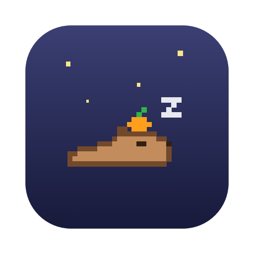
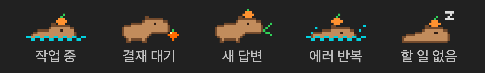

# 🍊 카피 출근부 (CapyWork)

**한국어** · [English](README.en.md)

Claude Code 세션마다 맥 상단바에 카피바라가 한 마리씩 나와서, 지금 일하는 중인지 내 확인을 기다리는 중인지 보여줘요.



| 카피바라 | 뜻 |
| --- | --- |
| 🌊 귤 얹고 헤엄 | Claude가 작업 중이에요. 오후 7시가 넘으면 🌙 달이 떠요 |
| 🍊 귤 굴리기 | 권한 승인을 기다려요. 5분 넘게 두면 귤이 빨갛게 깜빡이고 알림이 한 번 더 와요 |
| 🌿 풀 오물오물 | 답변이 끝났는데 아직 안 읽었어요 |
| 💦 허우적 | 명령이 연달아 실패하고 있어요 |
| 🎉 귤 던지기 | 세션이 끝났어요 (퇴근!) |
| 💤 귤 얹고 낮잠 | 지금은 아무 일도 없어요 |

## 써 보기

상단바 카피바라를 누르면 출근부가 열려요.

- **확인 필요 · 작업 중 · 오늘 근무** — 한눈에 보는 숫자
- **5시간 · 주간 사용량** — 얼마나 썼는지, 언제 초기화되는지
- **세션 목록** — 누르면 Claude 앱에서 그 세션이 바로 열려요
- **이번 주 잔디** — 요일별 근무 시간

카피바라를 **우클릭**하면 결재 대기 중인 세션으로 바로 가요.

## 설치

### 준비물

| 필요한 것 | 확인 방법 |
| --- | --- |
| macOS 15 (Sequoia) 이상 | 애플 메뉴 → 이 Mac에 관하여 |
| Xcode Command Line Tools | 없으면 `xcode-select --install` |
| Claude Code | `claude --version` |

### 설치하기

```bash
git clone https://github.com/E-JIWON/capywork.git
cd capywork
./install.sh
```

내 맥에서 소스를 직접 빌드해서, "확인되지 않은 개발자" 경고 없이 바로 켜져요. 설치하면 맥을 켤 때마다 자동으로 실행돼요.

- **업데이트** — `git pull && ./install.sh`
- **삭제** — `./uninstall.sh` (CapyWork가 추가한 것만 지우고, 원래 쓰던 hook과 statusLine은 그대로 둬요)

## 어떻게 동작해요?

- **로그인도, 네트워크도 안 써요.** 전부 내 맥 안의 파일만 읽어요.
- `install.sh` 가 `~/.claude/settings.json` 에 Claude Code hook을 등록해요. 기존 설정은 `settings.json.bak-capywork` 로 백업해요. hook은 세션 이벤트를 `~/.capywork/log/` 에 한 줄씩 남겨요.
- 사용량은 Claude Code statusLine이 넘겨주는 `rate_limits` 와 Claude 앱의 사용량 기록을 읽어요. 이미 statusLine을 쓰고 있으면 건드리지 않아요 (이때는 초기화 시각이 안 보일 수 있어요).
- 세션 제목, 읽음 여부, 세션 열기는 Claude 데스크톱 앱의 로컬 파일을 **읽기만** 해요.
- 처음 설치할 때 `~/.claude/projects` 의 대화 기록으로 지난 근무 시간을 계산해서 잔디를 채워요.

## 알아 두면 좋아요

- 터미널에서만 쓰는 세션은 읽음/안 읽음을 구분하지 못해요.
- Claude 앱 세션은 끝나도 퇴근 신호가 안 올 수 있어요.
- Claude 앱이 업데이트되면 세션 제목·열기 기능이 잠깐 안 될 수 있어요. 기본 기능은 그대로 돌아가요.

## 개발

```
Sources/
  CapyKit/        화면과 상관없는 핵심 로직 (이벤트 해석, 사용량, 카피바라 배치)
  CapyWork/       메뉴바 앱: SessionStore(@Observable) → MenuBar / Panel 컴포넌트
Tests/
  CapyKitTests/   단위 테스트
  CapyWorkTests/  hook → 화면까지 이어지는 통합 테스트, 라이트/다크 스냅샷
scripts/          hook.sh · statusline.sh · backfill.py (install.sh가 ~/.capywork로 복사)
tools/capy.py     카피바라 도트 생성기
```

```bash
swift build        # 빌드
swift test         # 테스트 (스냅샷 이미지는 .build/snapshots/)
CAPYWORK_HOME=/tmp/qa CAPYWORK_SELFCHECK=/tmp/qa/out "$(swift build --show-bin-path)/CapyWork"  # 상단바 클릭 자가 점검
open Package.swift # Xcode로 열기
```

전체 동작은 [docs/poses.png](docs/poses.png) 에 있어요.

---

Anthropic과 관계없는 개인 프로젝트예요. Claude는 Anthropic의 상표예요.
