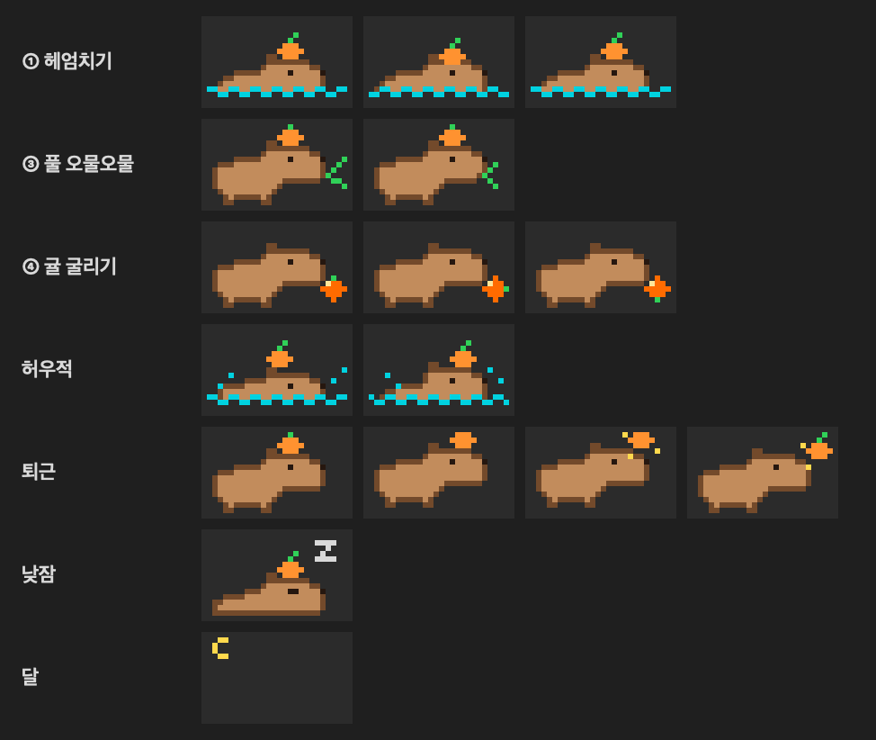

# 🍊 CapyWork — 카피 출근부

Claude Code 세션마다 상단바에 카피바라가 한 마리씩 나와서, 지금 뭘 하고 있는지 보여주는 macOS 메뉴바 앱.



| 상태 | 카피바라 |
|---|---|
| 작업 중 | 🌊 귤 얹고 헤엄 (오후 7시 이후엔 🌙) |
| 에러 반복 | 💦 물에서 허우적 |
| 새 답변 (안 읽음) | 🌿 풀 오물오물 |
| 결재 대기 | 🍊 귤 굴리기 (5분 넘게 방치하면 귤이 빨갛게 깜빡) |
| 퇴근 | 🎉 귤 던지기 |
| 할 일 없음 | 💤 귤 얹고 낮잠 |

카피바라를 클릭하면 패널이 열려:

- 확인 필요 / 작업 중 / 오늘 근무 시간
- 5시간 · 주간 사용량과 초기화 시각
- 세션 목록 (누르면 Claude 앱에서 그 세션이 열림)
- 이번 주 잔디

`⌃⌥⌘C` 를 누르면 결재 대기 중인 세션으로 바로 이동해.

## 설치

필요한 것: macOS 15 이상, Xcode Command Line Tools (`xcode-select --install`), Claude Code

```bash
git clone https://github.com/E-JIWON/capywork.git
cd capywork
./install.sh
```

소스에서 직접 빌드하기 때문에 "확인되지 않은 개발자" 경고 없이 바로 실행돼.

- 업데이트: `git pull && ./install.sh`
- 삭제: `./uninstall.sh`

## 어떻게 동작해?

- **로그인 없음, 네트워크 없음.** 전부 내 맥 안의 파일만 읽어.
- `install.sh` 가 `~/.claude/settings.json` 에 Claude Code hook을 등록해 (기존 hook은 그대로 두고, 원본은 `settings.json.bak-capywork` 로 백업). hook은 세션 이벤트를 `~/.capywork/log/` 에 한 줄씩 남겨.
- 사용량은 Claude Code statusLine이 넘겨주는 `rate_limits` 와 Claude 앱의 사용량 기록을 읽어. 이미 statusLine을 쓰고 있으면 건드리지 않아 (이 경우 초기화 시각은 안 보일 수 있어).
- 세션 제목·읽음 여부·세션 열기는 Claude 데스크톱 앱의 로컬 파일을 **읽기만** 해서 알아내. Claude 앱이 업데이트되면 이 부분은 깨질 수 있어.
- 처음 설치할 때 `~/.claude/projects` 대화 기록으로 지난 근무 시간을 계산해서 잔디를 채워.

## 알려진 한계

- 터미널에서만 쓰는 세션은 읽음/안 읽음 구분이 안 돼.
- Claude 앱 세션은 "퇴근" 신호가 안 올 수 있어.

## 개발

- 앱: `CapyWork.swift` 한 파일 (SwiftUI `MenuBarExtra`)
- 자체 테스트: `swiftc -parse-as-library CapyWork.swift -o /tmp/capywork && /tmp/capywork --selftest`
- 카피바라 도트: `tools/capy.py` (도형 조합으로 프레임 생성)

---

Anthropic과 관계없는 개인 프로젝트예요. Claude는 Anthropic의 상표입니다.
